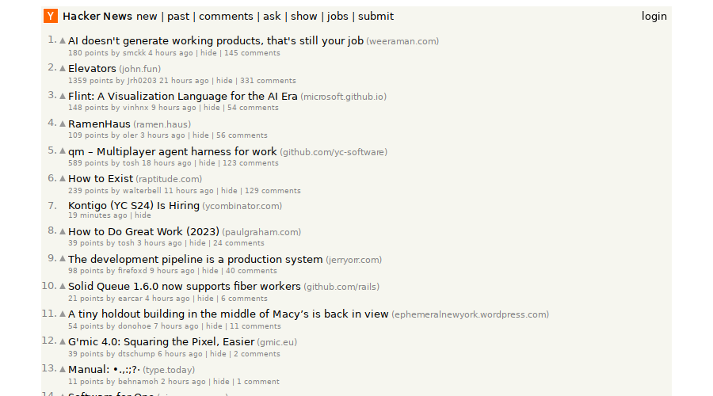

# servo

The [Servo](https://servo.org) browser engine, compiled to `wasm32-wasip2` and
packaged as a [WebAssembly component](https://component-model.bytecodealliance.org/).
It loads a page, runs its scripts, lays it out, rasterizes it on the CPU, and
hands back a PNG and the DOM — with no browser, no display server, no GPU, and no
network unless the caller grants it.



That is a live fetch of `news.ycombinator.com`, rendered inside a wasm sandbox.

## Read this before you get excited

This is a real engine with real limits. In rough order of how likely you are to
hit them:

- **One document per instance.** Not one at a time — one, for the life of the
  instance. Servo gives every document a script thread, every script thread
  creates a SpiderMonkey `JSContext`, SpiderMonkey allows one of those per
  thread, and a wasip2 guest has exactly one thread. So there is no `navigate`
  tool and a second session is refused. **This is not a crawler.**
- **Slow and heavy.** 7–24 s for a cold render, **~3 GB peak RSS** per instance,
  113 MB artifact. Rendering is single-threaded and on the CPU.
- **Only the fonts it carries** — DejaVu Sans, Serif and Sans Mono. No CJK, no
  Arabic, no Devanagari, and no colour emoji.
- **No WebGL, no GPU.** A heavy page is slow rather than impossible.
- The engine is a **fork**: ~2.3k lines against upstream Servo, plus small
  patches to five dependencies. All of it is public and linked below.

What it is good at: rendering *one* page faithfully, locally, in a sandbox, and
letting you poke at it.

## Try it

Needs [`act`](https://github.com/actcore/act-cli). Grab the component from the
[latest release](https://github.com/actpkg/servo/releases/latest):

```bash
mkdir -p /tmp/servo   # the engine keeps client storage on disk

act call servo.wasm render \
  --grant '{"wasi:filesystem":{"mode":"allowlist","allow":[{"path":"/tmp/servo/**","mode":"rw"}]}}' \
  --allow wasi:sockets \
  --args '{"url":"https://example.com/","width":800,"height":600}'
```

Two content parts come back: an `image/png` screenshot and the `text/html` DOM as
it stands *after* scripts have run.

## Interacting with a page

Open a session and the page stays live between calls:

| tool | |
| --- | --- |
| `dom` | the page's HTML, after scripting |
| `eval` | run JavaScript, get the result as text |
| `click` | click a point, in whole CSS pixels from the top-left |
| `scroll` | scroll by a delta in whole CSS pixels |
| `screenshot` | capture the current state as a PNG |

`eval` is the general-purpose escape hatch. To click a named element rather than
a coordinate, ask the page where it is first:

```js
var r = document.querySelector('#submit').getBoundingClientRect();
JSON.stringify([Math.round(r.left + r.width / 2), Math.round(r.top + r.height / 2)])
```

Scripts really do run — this is a page whose entire content was built by
JavaScript after load:


## Capabilities

| capability | why |
| --- | --- |
| `wasi:filesystem` | the engine keeps client storage on disk and will not start without a writable directory — scope it to a temp dir |
| `wasi:sockets` | needed to load anything over the network; without it only inline HTML renders, and a page that tries to fetch gets the engine's own error document |

The second one is the interesting half. The page runs inside the sandbox, so what
it can reach is the caller's decision, not the page's.

## Building it

```bash
just build   # cargo build --target wasm32-wasip2 --release
just pack    # embed act:component + act:skill metadata
just test    # e2e against `act run --http`
```

Needs [wasi-sdk](https://github.com/WebAssembly/wasi-sdk/releases) at
`/opt/wasi-sdk` — the engine compiles a lot of C along the way: SpiderMonkey,
FreeType, aws-lc-rs, swgl.

Be warned about the first build: the engine is a git dependency, so cargo fetches
Servo's full history — about 1.7 GB — before compiling anything, and then
compiles a browser. Half an hour is normal. You do not need a Servo checkout of
your own, and the fetch is cached per machine.

If you only want to *use* the component, take the release artifact instead; none
of this applies.

## How it was done

wasip2 has no threads: `std::thread::spawn` does not fail to compile, it fails at
*run time* with `os error 58`. Servo is a set of actors that each expect a thread
of their own, so every one of them became a task on a single `tokio` `LocalSet` —
and the rule that falls out of that is the whole port in one line:

> On a single-threaded host, a synchronous cross-actor request/response is a
> deadlock. Each one must become an `.await`, or a direct call.

Layout, for instance, asks the font service for glyphs from deep inside
synchronous text shaping, and cannot yield — so the font service answers it by
direct call instead of over a channel. Input events hit the same wall through
`RenderApi::hit_test`, solved by taking WebRender's *shared* hit tester and
polling it rather than waiting for the render backend to reply.

Rendering is [swgl](https://github.com/servo/webrender/tree/main/swgl), Mozilla's
software GL, so WebRender draws into ordinary memory. Text is FreeType, which
turns out to compile for `wasm32-wasip2` unmodified — given a build that skips
libpng (it wants a zlib the sysroot lacks) and links `libsetjmp` for the wasm SjLj
lowering.

Most of this becomes unnecessary once [cooperative
threads](https://github.com/WebAssembly/wasi-libc) land: they are implemented in
wasi-libc today, blocking calls suspend the thread rather than the world, and each
thread gets its own TLS — which is exactly what the one-document limit is waiting
for. That needs LLVM 23 and a wasip3 Rust target first.

## The forks

| repo | what it carries |
| --- | --- |
| [GamePad64/servo](https://github.com/GamePad64/servo/tree/wasip2-port) | the port itself, ~2.3k lines |
| [GamePad64/webrender](https://github.com/GamePad64/webrender/tree/wasip2) | three threads and a rayon pool become tasks; FreeType glyph backend on wasm |
| [GamePad64/ipc-channel](https://github.com/GamePad64/ipc-channel/tree/wasip2) | the global router runs as a task |
| [GamePad64/surfman](https://github.com/GamePad64/surfman/tree/wasip2) | a wasi platform with a null device |
| [GamePad64/imsz](https://github.com/GamePad64/imsz/tree/wasip2) | one cfg line — the `Stdin` impl recursed on non-unix targets |
| [GamePad64/freetype-sys](https://github.com/GamePad64/freetype-sys/tree/wasip2) | PNG support made optional, off for wasm |

## Licence

MPL-2.0, matching Servo.
